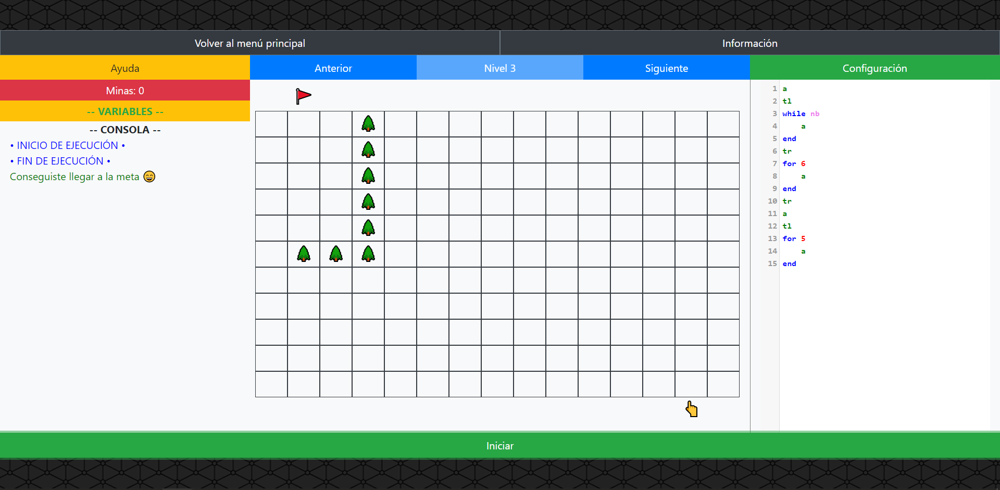

# 🤖 ROBOT CON PSEUDOCÓDIGO

Puedes probarlo accediendo a la siquiente página web: [🌐https://jose-web.github.io/robot-con-pseudo-codigo](https://jose-web.github.io/robot-con-pseudo-codigo)

---

🎮 El juego consiste en un robot que debe evitar los obstáculos y desactivar las minas, hasta llegar a la salida del mapa, gracias al código que escriba el jugador para que el robot se mueva.

---

👨‍🎓 Este juego está diseñado para aprender las mecánicas básicas de la programación.

---

©️ Este juego ha sido realizado únicamente por mi en el instituto mar de alborán para un proyecto llamado DEMETER